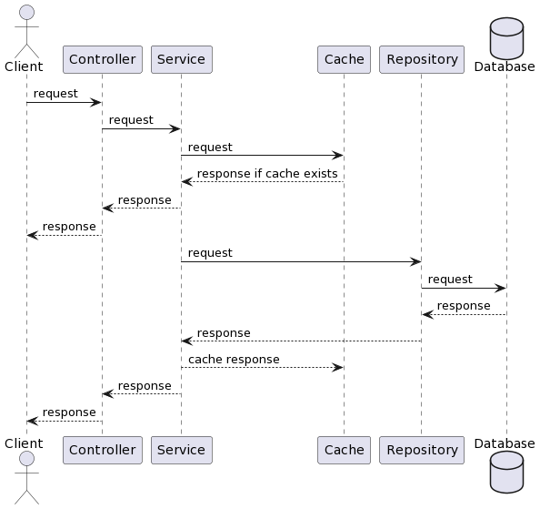
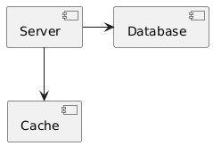
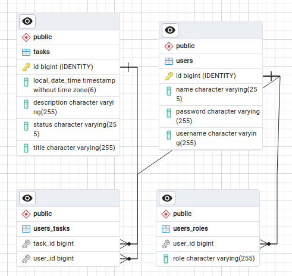

# Task Manager
Task Manager is an application for manager daily tasks.

You can access Swagger and see all available endpoints by
visiting `http://localhost:8080/swagger-ui/index.html`

**User Management:**
- user authentication and authorization using Spring Security and JWT tokens;
- user registration, login, and token refresh functionality;
- user roles management.

**Task Management:**
- create, update, delete tasks;
- retrieve tasks by user or for a specific time period;
- task assignment and ownership checks.

**Email Notifications:**
- sends registration confirmation emails;
- sends task reminder emails based on scheduled tasks.

## Sequence diagram

## Component diagram

Main application communicates with cache (Redis), database (Postgresql).

## Class diagram

We have two main classes - **User** and **Task**.

User can have roles - `ROLE_USER` or `ROLE_ADMIN`.
## Environments
To run this application you need to create `.env` file in root directory with
next environments:

- `HOST` - host of Postgresql database
- `POSTGRES_USERNAME` - username for Postgresql database
- `POSTGRES_PASSWORD` - password for Postgresql database
- `POSTGRES_DATABASE` - name of Postgresql database
- `REDIS_HOST` - host of Redis instance
- `REDIS_PASSWORD` - password for Redis
- `JWT_SECRET` - secret string for JWT tokens
- `SPRING_MAIL_HOST` - host of mail server
- `SPRING_MAIL_PORT` - port of mail server
- `SPRING_MAIL_USERNAME` - username of mail server
- `SPRING_MAIL_PASSWORD` - password of mail server

## Technology Stack
- `Java 17`;
- `Spring Boot`;
- `Spring Security` - using JWT for securing API;
- `Spring Data JPA`;
- `PostgreSQL` - primary relational database management system used for storing persistent data;
- `Redis` - in-memory data store used for caching;
- `Docker` - containerization tool used to package the application and its dependencies for consistent deployment;
- `Swagger`;
- `Maven`.
